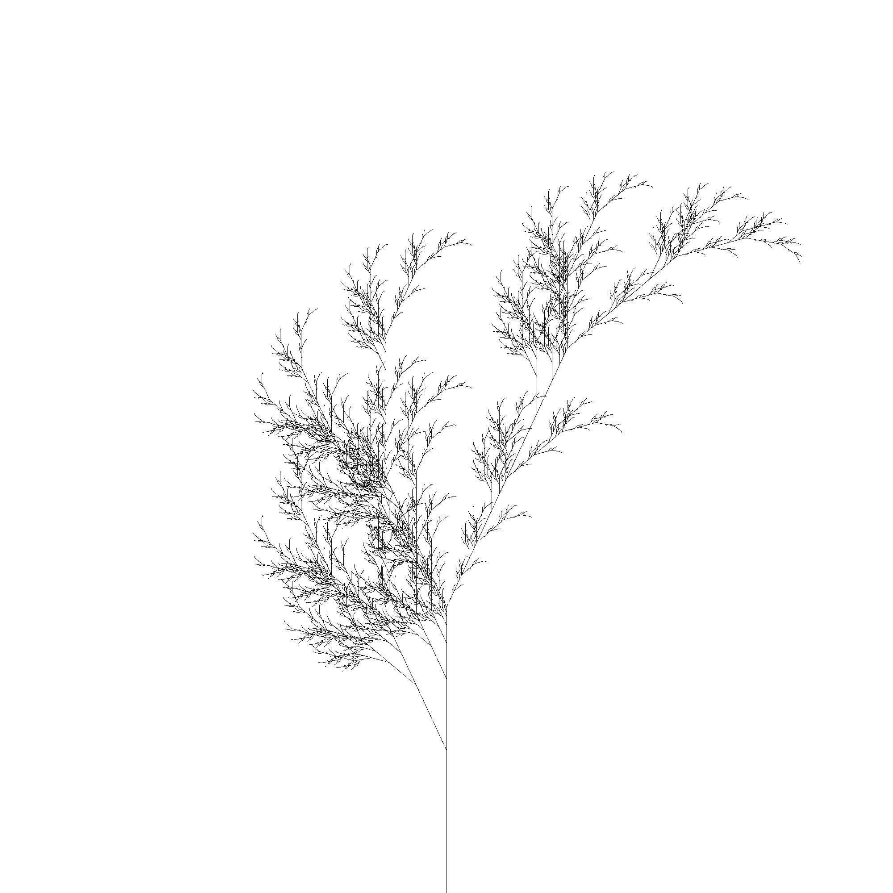

# LSystem

home
: https://hg.sr.ht/~ged/LSystem

code
: https://hg.sr.ht/~ged/LSystem

github
: https://github.com/ged/LSystem

docs
: https://deveiate.org/code/l_system

## Description

A toolkit for creating and using [Lindenmayer Systems][l-system] (L-systems).
It consists of a class that allows for declaration of the L-system's grammar,
and another class that allows for the definition of how the symbols output by a
grammar should be translated into work.

**Note** if you just want to draw with it, you should consider using
[kaki-lsystem][] instead; it has a nice interface with drawing already
integrated. This gem is intended for using l-systems for things other than
drawing (though it can obviously do that too), so it requires a bit more work.

### Examples

Most of these were stolen from [the examples on Wikipedia][l-system], and can be found in the `examples/` directory of the source.

#### Algae

Lindenmayer's original L-system for modelling the growth of algae.

* variables : A B
* constants : none
* axiom : A
* rules : (A → AB), (B → A)

Declare the rules:

    algae = LSystem.declare do
    
    	variables :A, :B
    	axiom 'A'
    	rules 'A -> AB',
    	    'B -> A'
    
    end

then iterate it 8 times and print out each generation:

    iter = algae.each
    8.times do |i|
        puts "n = %d : %s" % [ i, iter.next ]
    end

This outputs:

    n = 0 : A
    n = 1 : AB
    n = 2 : ABA
    n = 3 : ABAAB
    n = 4 : ABAABABA
    n = 5 : ABAABABAABAAB
    n = 6 : ABAABABAABAABABAABABA
    n = 7 : ABAABABAABAABABAABABAABAABABAABAAB

You can also do more complex tasks with the symbols in each generation. For example, to generate pretty pictures.

#### Barnsley fern

* variables : X F
* constants : + − [ ]
* axiom : X
* rules : (X → F+[[X]-X]-F[-FX]+X), (F → FF)
* angle : 25°

Declare the rules:

    fern = LSystem.declare do
    
      variables 'X', 'F'
      constants '+', '-', '[', ']'
      axiom 'X'
      rules \
        'X → F+[[X]-X]-F[-FX]+X',
        'F → FF'
    
    end

Then hook them up to a Logo interpreter ([a monkeypatched version][tortoise-patch] of the [Tortoise gem][tortoise-gem]):

    LSystem.run( fern, 8 ) do
    
      # The size of the canvas to draw on
      CANVAS_SIZE = 2000
    
      # F: draw forward
      # X : no-op
      # -: turn left 25°
      # +: turn right 25°
      # [: push position and angle
      # ]: pop position and angle
      production_map \
        'F' => :forward,
        '-' => :turn_left,
        '+' => :turn_right,
        '[' => :save_pos_and_angle,
        ']' => :restore_pos_and_angle
    
      ### Set up some instance variables
      def initialize( * )
        super
        @turtle = nil
        @positions = []
      end
    
    
      on_start do |i, _|
        @turtle = Tortoise::Interpreter.new( CANVAS_SIZE )
        @turtle.setpos( CANVAS_SIZE / 2, 0 )
        @turtle.direction = 90
        @turtle.pd
      end
    
    
      on_finish do |i, _|
        File.open( "fern_gn#{i}.png", File::WRONLY|File::TRUNC|File::CREAT, 0644, encoding: 'binary' ) do |fh|
          fh.write( @turtle.to_png )
        end
      end
    
    
      ### Draw a line forward
      def forward
        @turtle.fd( 5 )
      end
    
    
      ### Turn 25° to the left
      def turn_left
        @turtle.lt( 25 )
      end
    
    
      ### Turn 25° to the right
      def turn_right
        @turtle.rt( 25 )
      end
    
    
      ### Save the drawing position and angle
      def save_pos_and_angle
        @positions.push([ @turtle.position, @turtle.direction ])
      end
    
    
      ### Restore the next saved position and angle
      def restore_pos_and_angle
        to_restore = @positions.pop or raise IndexError, "Position stack underflow"
    
        @turtle.setpos( *to_restore.first )
        @turtle.direction = to_restore.last
      end
    
    end

This generates a sequence of images, which for generation 8 yields:

## Prerequisites

* Ruby

## Installation

    $ gem install l_system

## Contributing

You can check out the current development source with Mercurial via its
[project page](https://hg.sr.ht/~ged/LSystem). Or if you prefer Git, via
[its Github mirror](https://github.com/ged/l_system).

After checking out the source, run:

    $ rake setup

This task will install dependencies, and do any other necessary setup for development.

## Authors

- Michael Granger <ged@faeriemud.org>

## License

Copyright (c) 2020, Michael Granger
All rights reserved.

Redistribution and use in source and binary forms, with or without
modification, are permitted provided that the following conditions are met:

* Redistributions of source code must retain the above copyright notice,
  this list of conditions and the following disclaimer.

* Redistributions in binary form must reproduce the above copyright notice,
  this list of conditions and the following disclaimer in the documentation
  and/or other materials provided with the distribution.

* Neither the name of the author/s, nor the names of the project's
  contributors may be used to endorse or promote products derived from this
  software without specific prior written permission.

THIS SOFTWARE IS PROVIDED BY THE COPYRIGHT HOLDERS AND CONTRIBUTORS "AS IS"
AND ANY EXPRESS OR IMPLIED WARRANTIES, INCLUDING, BUT NOT LIMITED TO, THE
IMPLIED WARRANTIES OF MERCHANTABILITY AND FITNESS FOR A PARTICULAR PURPOSE ARE
DISCLAIMED. IN NO EVENT SHALL THE COPYRIGHT OWNER OR CONTRIBUTORS BE LIABLE
FOR ANY DIRECT, INDIRECT, INCIDENTAL, SPECIAL, EXEMPLARY, OR CONSEQUENTIAL
DAMAGES (INCLUDING, BUT NOT LIMITED TO, PROCUREMENT OF SUBSTITUTE GOODS OR
SERVICES; LOSS OF USE, DATA, OR PROFITS; OR BUSINESS INTERRUPTION) HOWEVER
CAUSED AND ON ANY THEORY OF LIABILITY, WHETHER IN CONTRACT, STRICT LIABILITY,
OR TORT (INCLUDING NEGLIGENCE OR OTHERWISE) ARISING IN ANY WAY OUT OF THE USE
OF THIS SOFTWARE, EVEN IF ADVISED OF THE POSSIBILITY OF SUCH DAMAGE.

[l-system]: https://en.wikipedia.org/wiki/L-system
[kaki-lsystem]: https://rubygems.org/gems/kaki-lsystem
[tortoise-gem]: https://rubygems.org/gems/tortoise
[tortoise-monkeypatch]: https://hg.sr.ht/~ged/LSystem/browse/default/examples/tortoise_monkeypatches.rb

